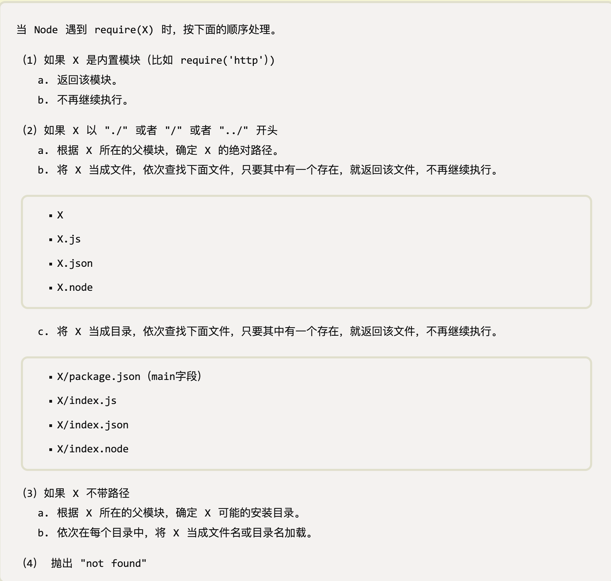

# NodeJS 中的 require 函数

在写 NodeJS 时，经常用到 **require** 函数，那么这个函数实现了什么功能呢？这篇文章一起研究下这个函数的内部实现。

## require 函数是如何寻找模块的

**require** 函数的入参数是路径或模块名称字符串，比如

```JS
const http = require('http')
// foo.js
const bar = require('./bar.js')
```

NodeJS 是这样查找模块路径的（摘自[阮一峰老师的博客](https://www.ruanyifeng.com/blog/2015/05/require.html)）



## require 函数源码

新建一个 JS 文件，打印 **module** 变量

```JS
// bar.js
console.log(module)
// 打印如下
Module {
  '9': [Function: internalRequire],
  id: '.',
  path: '/Users/WorkSpace/github_repo/Study-WorkSpace/NodeJS',
  exports: {},
  filename: '/Users/WorkSpace/github_repo/Study-WorkSpace/NodeJS/bar.js',
  loaded: false,
  children: [],
  paths: [
    '/Users/WorkSpace/github_repo/Study-WorkSpace/NodeJS/node_modules',
    '/Users/WorkSpace/github_repo/Study-WorkSpace/node_modules',
    '/Users/WorkSpace/github_repo/node_modules',
    '/Users/WorkSpace/node_modules',
    '/Users/node_modules',
    '/Users/node_modules',
    '/node_modules'
  ]
}
```

可以看出 module 是 Module 构造函数的一个实例。[require 源码](https://github.com/nodejs/node-v0.x-archive/blob/master/lib/module.js)

**require** 函数内部其实调用内部方法 \_load()

```JS
Module.prototype.require = function(path) {
  return Module._load(path, this);
};

Module._load = function(request, parent, isMain) {
  // 计算模块的绝对路径
  const filename = Module._resolveFilename(request, parent);

  // 如果缓存中存在该模块，返回模块的 exports 属性
  const cachedModule = Module._cache[filename];
  if (cachedModule) {
    return cachedModule.exports;
  }

  // 如果 request 是一个内置模块，调用 NativeModule.require()
  if (NativeModule.exists(filename)) {
    return NativeModule.require(filename)
  }

  // 不是内置模块，则生成 Module 的一个实例
  const module = new Module(filename, parent)

  // 存入缓存
  Module._cache[filename] = module

  // 加载模块，如果发生异常，则删除该模块的缓存
  let hadException = true;
  try {
    // 调用 Module.prototype.load 方法
    module.load(filename);
    hadException = false;
  } finally {
    if (hadException) {
      delete Module._cache[filename];
    }
  }

  return module.exports;
}
```

这个方法中，重要的函数只有 2 个

- 计算绝对路径：\_resolveFilename
- 加载模块：load

```JS
Module._resolveFilename = function(request, parent) {
  if (NativeModule.exists(request)) {
    return request;
  }

  // 查找模块所有可能的路径
  const resolvedModule = Module._resolveLookupPaths(request, parent);

  const id = resolvedModule[0];
  const paths = resolvedModule[1];

  const filename = Module._findPath(request, paths);
  if (!filename) {
    const err = new Error("Cannot find module '" + request + "'");
    err.code = 'MODULE_NOT_FOUND';
    throw err;
  }
  return filename;
}
```

\_resolveLookupPaths 方法返回模块的 id 和所有可能的路径，类似这样

```JS
[
  '/Users/WorkSpace/github_repo/Study-WorkSpace/NodeJS/node_modules',
  '/Users/WorkSpace/github_repo/Study-WorkSpace/node_modules',
  '/Users/WorkSpace/github_repo/node_modules',
  '/Users/WorkSpace/node_modules',
  '/Users/node_modules',
  '/Users/node_modules',
  '/node_modules'
]
```

\_findPath 方法用来找到唯一正确的路径。

下面是 load 方法

```JS
Module.prototype.load = function(filename) {
  this.filename = filename;
  // 绝对路径
  this.paths = Module._nodeModulePaths(path.dirname(filename));

  const extension = path.extname(filename) || '.js';
  if (!Module._extensions[extension]) extension = '.js';
  Module._extensions[extension](this, filename);
  this.loaded = true;
}
```

根据后缀名执行不同文件的加载逻辑

```JS
// Native extension for .js
Module._extensions['.js'] = function(module, filename) {
  const content = fs.readFileSync(filename, 'utf8');
  module._compile(stripBOM(content), filename);
};

// Native extension for .json
Module._extensions['.json'] = function(module, filename) {
  const content = fs.readFileSync(filename, 'utf8');
  try {
    module.exports = JSON.parse(stripBOM(content));
  } catch (err) {
    err.message = filename + ': ' + err.message;
    throw err;
  }
};

//Native extension for .node
Module._extensions['.node'] = process.dlopen;
```

js 文件 compile 方法

```JS
Module.prototype._compile = function(content, filename) {
  const self = this
  const args = [self.exports, require, self, filename, dirname];

  const wrapper = Module.wrap(content);
  const compiledWrapper = runInThisContext(wrapper, { filename: filename });
  // vm 的执行环境，加载代码
  return compiledWrapper.apply(self.exports, args);
};
```
